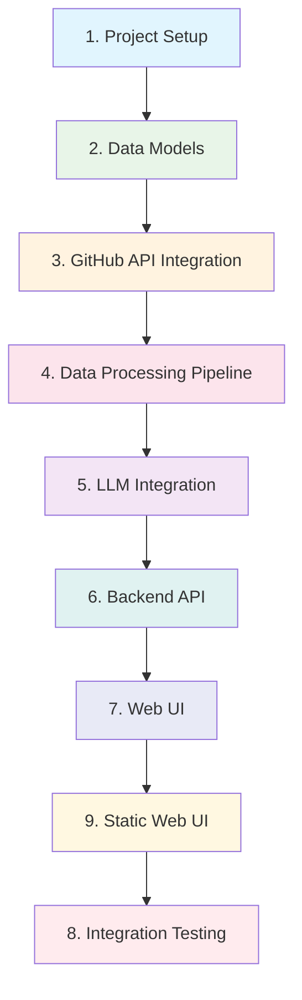

# Implementation Plan

## Overview

This implementation plan provides a detailed roadmap for developing the GitHub PR comment analysis system. The plan is structured into 8 major tasks that build incrementally on each other, focusing on technical implementation, testing, and clear completion criteria.

## Implementation Plan

### [ ] 1. Project Setup and Infrastructure Foundation

- **Specific implementation details**:
  - Initialize Python project with virtual environment and requirements.txt
  - Set up SQLite database with proper schema and indexes
  - Configure FastAPI backend with basic structure
  - Set up GitHub API authentication and rate limiting handling
  - Create project directory structure with clear separation of concerns
- **Testing and validation requirements**:
  - Write unit tests for database connection and basic API endpoints
  - Test GitHub API authentication and rate limiting
  - Validate database schema creation and basic CRUD operations
- **Requirements**: FR-DC-01, FR-DC-03, NF-SEC-01, NF-MNT-01

### [ ] 2. Core Data Models and Database Layer

- **Specific implementation details**:
  - Implement SQLAlchemy ORM models for all database tables
  - Create database initialization scripts for SQLite
  - Implement database connection management and error handling
  - Create seed data for testing and development
  - Add comprehensive data validation and constraints
- **Testing and validation requirements**:
  - Write unit tests for all ORM models and relationships
  - Test data validation and constraint enforcement
  - Verify database initialization scripts work correctly
  - Test database connection management and error recovery
- **Requirements**: FR-DC-03, NF-REL-01, NF-MNT-01

### [ ] 3. GitHub API Integration and Data Collection Service

- **Specific implementation details**:
  - Implement GitHub API client with OAuth authentication
  - Create data collection service for pull requests and review comments
  - Implement pagination handling for large result sets
  - Add rate limiting and retry logic with exponential backoff
  - Create data validation and sanitization for GitHub API responses
- **Testing and validation requirements**:
  - Write unit tests for GitHub API client with mocked responses
  - Test pagination and rate limiting handling
  - Validate data collection for various PR scenarios
  - Test error handling for API failures and network issues
- **Requirements**: FR-DC-01, FR-DC-02, NF-PERF-01, NF-REL-01

### [ ] 4. Data Processing and Storage Pipeline

- **Specific implementation details**:
  - Create Celery tasks for async data processing
  - Implement data transformation and enrichment logic
  - Create code snippet extraction and storage
  - Implement comment thread analysis and grouping
  - Add data quality checks and error logging
- **Testing and validation requirements**:
  - Write unit tests for data transformation logic
  - Test Celery task execution and error handling
  - Validate code snippet extraction accuracy
  - Test data quality validation and error logging
- **Requirements**: FR-DC-02, FR-DC-03, NF-REL-01, NF-PERF-02

### [ ] 5. LLM Integration and Rule Extraction Service

- **Specific implementation details**:
  - Implement OpenAI API client with proper authentication
  - Create prompt engineering templates for rule extraction
  - Develop rule parsing and validation logic
  - Implement confidence scoring and categorization
  - Add response caching for similar prompts
- **Testing and validation requirements**:
  - Write unit tests for LLM client with mocked responses
  - Test prompt templates and response parsing
  - Validate rule extraction accuracy and confidence scoring
  - Test error handling for LLM API failures
- **Requirements**: FR-DA-01, FR-DA-02, NF-PERF-01, NF-REL-01

### [ ] 6. Backend API Development and Business Logic

- **Specific implementation details**:
  - Implement FastAPI endpoints for all business operations
  - Create API request validation and response schemas
  - Implement business logic for rule analysis and statistics
  - Add pagination and filtering for API responses
  - Create comprehensive error handling and logging
- **Testing and validation requirements**:
  - Write comprehensive API integration tests
  - Test request validation and response schemas
  - Validate business logic with various scenarios
  - Test API performance and error handling
- **Requirements**: FR-DC-01, FR-DA-01, FR-DP-01, NF-PERF-01, NF-MNT-01

### [ ] 7. Web UI Development and Data Presentation

- **Specific implementation details**:
  - Create React frontend application with modern UI components
  - Implement dashboard with rule statistics and trends
  - Develop rule browsing and search functionality
  - Create PR detail view with code snippets and comments
  - Add responsive design and accessibility features
- **Testing and validation requirements**:
  - Write unit tests for React components
  - Test UI responsiveness and accessibility
  - Validate data visualization and search functionality
  - Test user interaction flows and error states
- **Requirements**: FR-DP-01, FR-DP-02, NF-PERF-01, NF-MNT-01

### [ ] 9. Static Web UI Development and Data Presentation

- **Specific implementation details**:
  - Create static HTML pages with modern CSS styling
  - Implement dashboard with rule statistics and trends using JavaScript
  - Develop rule browsing and search functionality with vanilla JS
  - Create PR detail view with code snippets and comments
  - Add responsive design using CSS Grid and Flexbox
- **Testing and validation requirements**:
  - Write unit tests for JavaScript functions
  - Test UI responsiveness across different screen sizes
  - Validate data visualization and search functionality
  - Test user interaction flows and error states
- **Requirements**: FR-DP-01, FR-DP-02, NF-PERF-01, NF-MNT-01

### [ ] 8. Integration Testing, Performance Optimization, and Deployment

- **Specific implementation details**:
  - Create end-to-end integration tests for complete workflows
  - Implement performance optimization with caching and SQLite indexing
  - Add monitoring and logging for production deployment
  - Create deployment scripts and configuration
  - Set up CI/CD pipeline for automated testing and deployment
- **Testing and validation requirements**:
  - Conduct comprehensive end-to-end testing
  - Performance testing under load conditions
  - Validate deployment process and rollback procedures
  - Test monitoring and alerting systems
- **Requirements**: All functional and non-functional requirements, NF-PERF-02, NF-REL-01, NF-REL-02

## Task Dependencies and Sequence

## Success Criteria for Each Task

### Task 1: Project Setup and Infrastructure Foundation

- [ ] Python project structure created with proper dependencies
- [ ] PostgreSQL database schema implemented with all tables
- [ ] FastAPI backend structure established
- [ ] GitHub API authentication configured
- [ ] All unit tests passing

### Task 2: Core Data Models and Database Layer

- [ ] All SQLAlchemy models implemented with proper relationships
- [ ] Database migration scripts working correctly
- [ ] Data validation and constraints enforced
- [ ] Database connection pooling configured
- [ ] All unit tests passing

### Task 3: GitHub API Integration and Data Collection Service

- [ ] GitHub API client fully functional with authentication
- [ ] Data collection service working for PRs and comments
- [ ] Rate limiting and retry logic implemented
- [ ] Data validation and sanitization working
- [ ] All unit tests passing

### Task 4: Data Processing and Storage Pipeline

- [ ] Celery tasks configured and working
- [ ] Data transformation logic implemented
- [ ] Code snippet extraction working
- [ ] Comment thread analysis functional
- [ ] All unit tests passing

### Task 5: LLM Integration and Rule Extraction Service

- [ ] OpenAI API client configured and working
- [ ] Prompt templates implemented and tested
- [ ] Rule parsing and validation functional
- [ ] Confidence scoring working
- [ ] All unit tests passing

### Task 6: Backend API Development and Business Logic

- [ ] All FastAPI endpoints implemented
- [ ] Request validation and response schemas working
- [ ] Business logic fully functional
- [ ] Pagination and filtering working
- [ ] All integration tests passing

### Task 7: Web UI Development and Data Presentation

- [ ] React frontend application complete
- [ ] Dashboard with statistics and trends working
- [ ] Rule browsing and search functional
- [ ] PR detail view implemented
- [ ] All UI tests passing

### Task 8: Integration Testing, Performance Optimization, and Deployment

- [ ] End-to-end integration tests complete
- [ ] Performance optimizations implemented
- [ ] Monitoring and logging configured
- [ ] Deployment scripts working
- [ ] CI/CD pipeline established

## Risk Mitigation

### Technical Risks

- **GitHub API Changes**: Implement flexible API client with version handling
- **LL Service Downtime**: Implement retry logic and caching strategies
- **Database Performance**: Optimize queries and implement proper indexing
- **Rate Limiting**: Implement intelligent queuing and backoff strategies

### Project Risks

- **Scope Creep**: Strictly follow defined requirements and change management
- **Timeline Delays**: Regular progress reviews and milestone tracking
- **Quality Issues**: Comprehensive testing and code review process
- **Resource Constraints**: Clear task prioritization and dependency management

## Quality Assurance Strategy

### Testing Approach

- **Unit Testing**: Individual components and functions
- **Integration Testing**: Component interactions and API endpoints
- **End-to-End Testing**: Complete user workflows
- **Performance Testing**: Load and stress testing
- **Security Testing**: Input validation and authentication

### Code Quality

- **Code Reviews**: Peer review for all major changes
- **Static Analysis**: Automated code quality checks
- **Documentation**: Comprehensive inline documentation
- **Standards**: Consistent coding standards and style guides

## Monitoring and Maintenance

### Production Monitoring

- **Application Health**: Real-time monitoring of system components
- **Performance Metrics**: Response times, error rates, resource usage
- **Business Metrics**: Data collection rates, rule extraction success
- **Alerting**: Proactive alerts for critical issues

### Maintenance Planning

- **Regular Updates**: Security patches and dependency updates
- **Performance Tuning**: Ongoing optimization based on usage patterns
- **Feature Enhancements**: Planned improvements based on user feedback
- **Documentation Updates**: Keep documentation current with system changes
